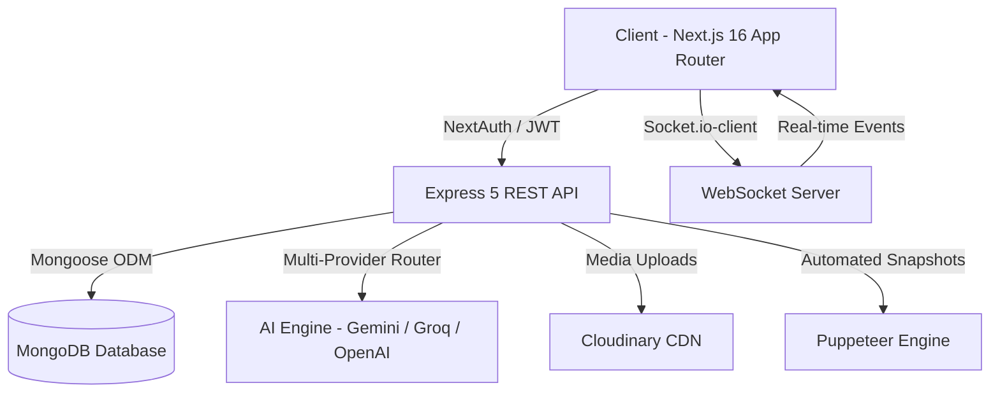

# 🚀 AI Website Builder

> **From Prompt to Production:** Instantly generate, preview, customize, and export stunning, modern, responsive websites using the power of multi-model AI.

---

## 🌟 Overview

**AI Website Builder** is an intelligent web creation platform that turns natural language ideas into production-ready web applications. Whether you need a high-converting SaaS landing page, a sleek developer portfolio, or an e-commerce storefront, simply describe your vision and watch the AI write the code, style the components, and spin up an interactive live preview in seconds.

---

## ✨ Key Features

### ⚡ 1. Intelligent Prompt-to-Website Generation
- **Natural Language Creation**: Describe what you want in plain English (or choose a theme), and the platform will generate fully styled, responsive HTML, CSS, and interactive JavaScript.
- **Smart Component Architecture**: Builds clean semantic markup, modern responsive layouts, accessible elements, and micro-animations.
- **Multi-Model AI Engine**: Powered by state-of-the-art LLMs (Google Gemini, Groq, and OpenAI) with automated fallback routing to guarantee high availability and blazing-fast generation speeds.
- **Bring Your Own Keys (BYOK)**: Flexibility to use platform quotas or provide your own API keys for unlimited generations.

### 🖥️ 2. Live Sandboxed Responsive Preview
- **Interactive Sandbox**: Test forms, buttons, animations, and transitions in a secure real-time iframe environment.
- **Multi-Device Viewports**: Instantly toggle between **Desktop**, **Tablet**, and **Mobile** views to test responsive behavior across all screen sizes.
- **Automated Visual Snapshots**: Background preview capture using automated screenshot rendering so you always have a visual thumbnail of your projects.

### ✏️ 3. Built-In Code Explorer & Editor
- **File Tree Navigation**: Inspect generated files (`index.html`, `styles.css`, `script.js`, and assets) in a clean tabbed explorer.
- **Syntax Highlighting**: Read and review clean, formatted source code directly in the browser.
- **Direct Editing**: Tweak CSS variables, adjust copy, or add custom scripts directly inside the workspace editor.

### 🔄 4. Conversational Iterations & Version Control
- **Iterative AI Prompts**: Ask the AI to modify specific sections, swap color palettes, add testimonial carousels, or create contact forms.
- **Full Version Snapshots**: Every generation and refinement automatically saves a snapshot to your project history.
- **One-Click Rollbacks**: Seamlessly jump back and forth between previous versions without losing any work.

### 📦 5. One-Click Source Code Export
- **No Vendor Lock-In**: Own 100% of your code.
- **ZIP Download**: Export your entire website bundle as a clean `.zip` archive ready to deploy on **Vercel**, **Netlify**, **GitHub Pages**, or your own servers.

### 🎨 6. Curated Starter Templates
- Jumpstart your project with proven design layouts:
  - **SaaS & Tech Landing Pages**
  - **Modern Developer & Creator Portfolios**
  - **E-Commerce & Product Showcase Pages**
  - **Agency & Studio Showcases**

### 💬 7. Real-Time Support & Custom Requests
- **Interactive Assistance**: Need human design assistance, custom backend integrations, or tailored branding? Submit project assistance requests directly from your workspace.
- **Live WebSocket Chat**: Real-time two-way messaging with support specialists.
- **Rich Media Attachments**: Upload and share mockups, brand assets, PDFs, and wireframes directly inside the chat with instant delivery and read receipts.

### 👤 8. Profile & Workspace Management
- **Personalized Profile**: Upload and customize your profile avatar (hosted with high-speed CDN delivery via Cloudinary).
- **Daily Usage Tracking**: Transparent live counters showing your remaining daily AI generations and preview quota.
- **Secure Authentication**: Sign in via Email & Password (with email verification) or instant 1-click **Google OAuth**.

---

## 🛠️ Architecture & Tech Stack



### **Frontend**
- **Framework**: [Next.js 16](https://nextjs.org/) (App Router, Server & Client Components)
- **UI Library**: [React 19](https://react.dev/)
- **Styling**: [TailwindCSS](https://tailwindcss.com/) & Vanilla CSS with modern Glassmorphism aesthetics
- **Animations**: [Framer Motion](https://www.framer.com/motion/)
- **Icons**: [Lucide React](https://lucide.dev/)
- **Real-Time Client**: [Socket.IO Client](https://socket.io/)
- **Authentication**: [NextAuth.js](https://next-auth.js.org/) (Credentials + Google OAuth Provider)

### **Backend**
- **Runtime**: [Node.js](https://nodejs.org/) & [Express 5](https://expressjs.com/)
- **Database**: [MongoDB](https://www.mongodb.com/) with [Mongoose](https://mongoosejs.com/)
- **AI Integrations**: 
  - Google Gemini API (`@google/generative-ai`)
  - Groq SDK (`groq-sdk`)
  - OpenAI API (`openai`)
- **Real-Time Communication**: [Socket.IO](https://socket.io/) (rooms, read-receipts, delivery confirmations)
- **Asset Storage**: [Cloudinary](https://cloudinary.com/) (user avatars & project assets)
- **Automated Screenshots**: [Puppeteer](https://pptr.dev/)
- **Project Packaging**: [Archiver](https://www.npmjs.com/package/archiver) (ZIP streaming)
- **Authentication & Security**: JSON Web Tokens (JWT) & Bcrypt password hashing

---

## 🚀 Quick Start Guide

### Prerequisites
- **Node.js**: v18.0.0 or higher
- **npm** or **yarn** or **pnpm**
- **MongoDB**: A local MongoDB instance or a free [MongoDB Atlas](https://www.mongodb.com/atlas) cluster
- At least one AI API key ([Google AI Studio](https://aistudio.google.com/), [Groq](https://console.groq.com/), or [OpenAI](https://platform.openai.com/))

---

### 1. Clone the Repository
```bash
git clone https://github.com/your-username/website-builder.git
cd website-builder
```

---

### 2. Backend Setup

1. Navigate to the backend directory:
   ```bash
   cd backend
   ```

2. Install dependencies:
   ```bash
   npm install
   ```

3. Create a `.env` file in `backend/`:
   ```env
   PORT=5000
   DATABASE_URL=mongodb+srv://<username>:<password>@cluster.mongodb.net/website-builder?retryWrites=true&w=majority
   JWT_SECRET=your_jwt_secret_key_here
   CLIENT_URL=http://localhost:3000

   # AI API Keys (Add at least one)
   GEMINI_API_KEY=your_gemini_api_key
   GROQ_API_KEY=your_groq_api_key
   OPENAI_API_KEY=your_openai_api_key

   # Cloudinary (Avatar & Asset Storage)
   CLOUDINARY_CLOUD_NAME=your_cloud_name
   CLOUDINARY_API_KEY=your_cloudinary_api_key
   CLOUDINARY_API_SECRET=your_cloudinary_api_secret

   # Email Service (Verification & Notifications)
   EMAIL_HOST=smtp.gmail.com
   EMAIL_PORT=587
   EMAIL_USER=your_email@gmail.com
   EMAIL_PASS=your_app_password
   ```

4. Start the backend development server:
   ```bash
   npm run dev
   ```
   *The backend will start on `http://localhost:5000`.*

---

### 3. Frontend Setup

1. Open a new terminal and navigate to the frontend directory:
   ```bash
   cd frontend
   ```

2. Install dependencies:
   ```bash
   npm install
   ```

3. Create a `.env.local` file in `frontend/`:
   ```env
   NEXT_PUBLIC_API_URL=http://localhost:5000/api
   NEXT_PUBLIC_SOCKET_URL=http://localhost:5000
   NEXTAUTH_URL=http://localhost:3000
   NEXTAUTH_SECRET=your_nextauth_secret_key_here

   # Google OAuth (Optional for 1-click Google Sign-In)
   GOOGLE_CLIENT_ID=your_google_client_id.apps.googleusercontent.com
   GOOGLE_CLIENT_SECRET=your_google_client_secret
   ```

4. Start the frontend development server:
   ```bash
   npm run dev
   ```
   *The frontend will start on `http://localhost:3000`.*

---

## 📖 User Workflow

```
1. 🔐 Sign Up / Sign In
   └── Register with email or 1-click Google OAuth.

2. 💡 Prompt or Select a Template
   └── Enter a natural prompt (e.g. "Create a sleek dark-mode portfolio for a 3D designer")
       or choose from curated templates.

3. ⚡ Live Generation & Interactive Preview
   └── Watch the AI generate code. Preview in real-time with Desktop, Tablet, and Mobile switches.

4. 🔄 Conversational Refinement
   └── Prompt additional changes: "Make the hero background animated", "Add pricing cards".

5. 📦 Export Code
   └── Download complete, production-ready code as a ZIP and host anywhere.
```

---

## 🛡️ Best Practices & Quality Highlights
- **Clean Architecture**: Modular structure separating controllers, services, routes, and socket handlers.
- **Zero Lock-In**: Code generated is standard HTML5, CSS3, and JavaScript — no proprietary frameworks required to run exported sites.
- **Automatic Daily Limits Reset**: Quotas for free generations and preview sessions automatically sync and renew every 24 hours.
- **Responsive by Design**: All generated layouts are optimized for desktop, tablet, and mobile displays.

---

## 📄 License

This project is licensed under the [ISC License](LICENSE).